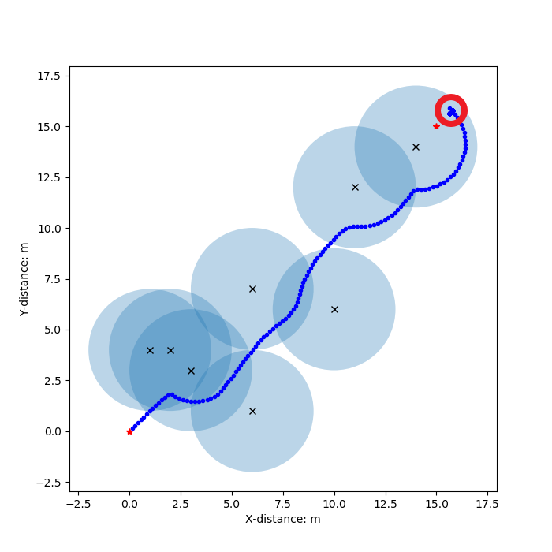

# 人工势场寻路算法

## Original Artificial Potential Field Method

+ 最基本的人工势场方法，会出现局部最小值问题导致寻路失败，此外还存在不可达问题（如下图）
+ 

## Improved Artificial Potential Field Method-1

+ 改进斥力函数，在斥力函数中也考虑机器人到目标点的距离影响，从而解决不可达问题
+ 